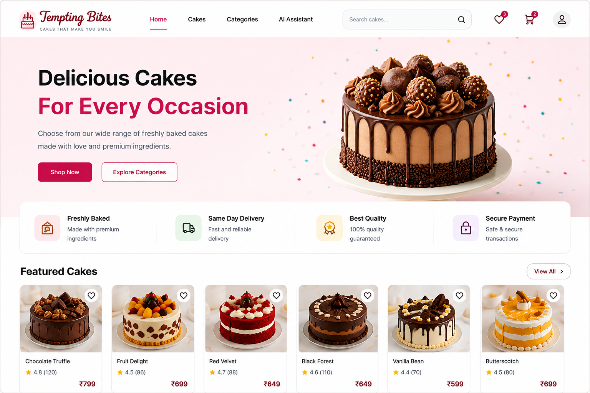
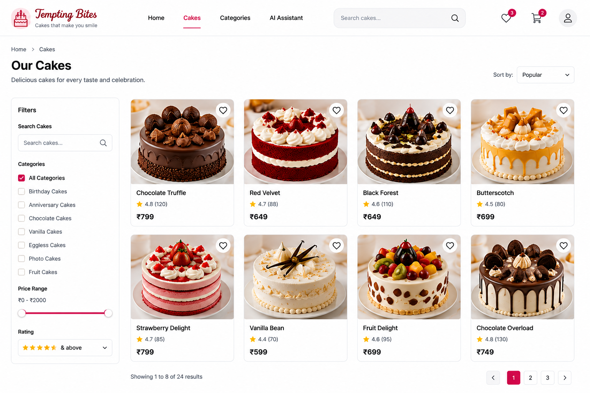
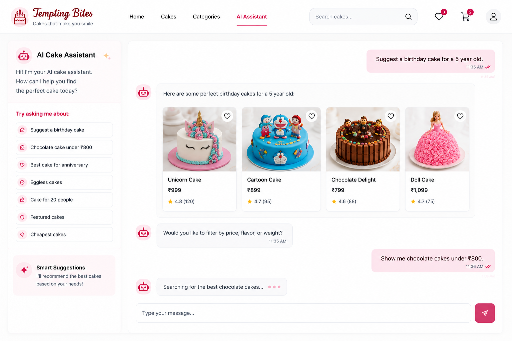
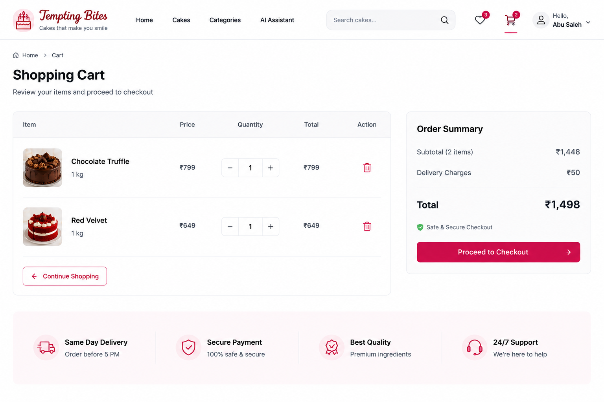
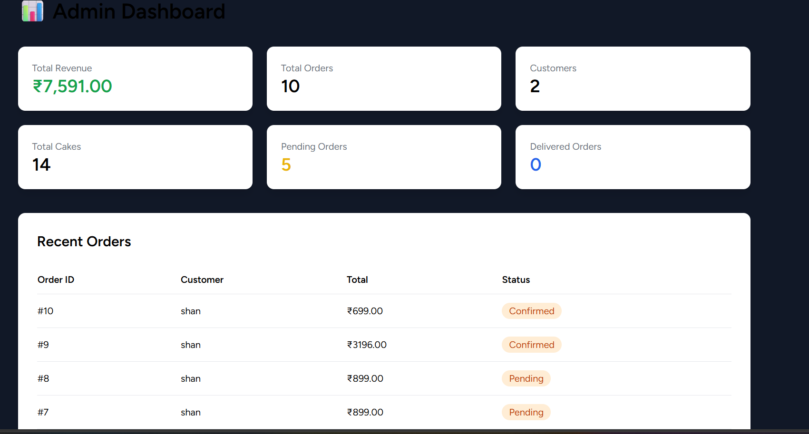
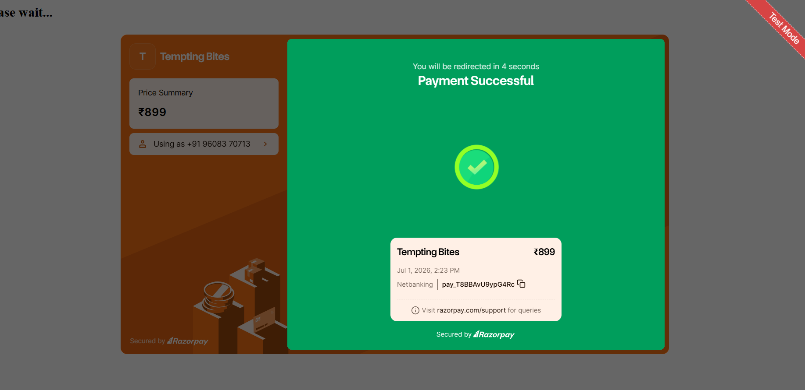

<div align="center">

# 🎂 Tempting Bites

### A Modern Full Stack Cake Ordering Platform

Built with **Laravel 12 • PHP • MySQL • Tailwind CSS • JavaScript • Railway**

🌐 **Live Demo:** https://tempting-bites-production.up.railway.app

</div>

---

# 📖 About The Project

Tempting Bites is a full-stack cake ordering platform designed to provide customers with a seamless online bakery experience.

The platform allows users to browse cakes, explore categories, add products to their wishlist or cart, place orders, and receive cake recommendations through an AI-powered assistant.

The project follows Laravel's MVC architecture and includes both customer and admin functionalities.

---

# ✨ Features

## 👤 Customer

- Secure User Authentication
- Browse Cakes
- Browse Categories
- Search Cakes
- Filter Cakes
- Wishlist
- Shopping Cart
- Order Placement
- Order History
- Reviews & Ratings
- Responsive Design

---

## 🤖 AI Cake Assistant

The AI assistant helps customers discover cakes based on:

- 🎂 Birthday
- 💍 Anniversary
- 💒 Wedding
- 🍫 Chocolate
- 🍓 Strawberry
- 🍦 Vanilla
- 🥚 Eggless
- 💰 Budget
- ⚖️ Weight
- ⭐ Featured Cakes

Example Questions

```
Suggest a birthday cake

Chocolate cake under ₹800

Best anniversary cake

Eggless cakes

Cake for 20 people
```

---

## 👨‍💼 Admin Dashboard

- Dashboard
- Manage Categories
- Manage Cakes
- Manage Orders
- Manage Reviews
- Featured Cakes
- Stock Management

---

# 🛠 Tech Stack

### Backend

- Laravel 12
- PHP 8.2

### Frontend

- Blade
- Tailwind CSS
- JavaScript
- Alpine.js
- Vite

### Database

- MySQL

### Deployment

- Railway

### Version Control

- Git & GitHub

---

# 📁 Project Structure

```
Tempting-Bites
│
├── app
├── bootstrap
├── config
├── database
├── public
├── resources
│   ├── views
│   ├── css
│   └── js
├── routes
├── storage
├── tests
└── README.md
```

---

# 🚀 Getting Started

## Clone Repository

```bash
git clone https://github.com/YOUR_USERNAME/tempting-bites.git
```

---

## Install Dependencies

```bash
composer install

npm install
```

---

## Configure Environment

```bash
cp .env.example .env
```

Generate Application Key

```bash
php artisan key:generate
```

---

## Configure Database

Update your `.env`

```env
DB_CONNECTION=mysql
DB_HOST=127.0.0.1
DB_PORT=3306
DB_DATABASE=tempting_bites
DB_USERNAME=root
DB_PASSWORD=
```

---

## Run Migrations

```bash
php artisan migrate
```

---

## Seed Database

```bash
php artisan db:seed
```

---

## Build Assets

```bash
npm run build
```

---

## Start Server

```bash
php artisan serve
```

---

# 🌍 Live Deployment

The application is successfully deployed on Railway.

### Production Configuration

- MySQL Database
- HTTPS Enabled
- Environment Variables
- Vite Asset Compilation
- Tailwind CSS
- GitHub Integration

---

# 📸 Project Preview

<table>
<tr>

<td align="center">

<h3>🏠 Home Page</h3>



</td>

<td align="center">

<h3>🍰 Cakes</h3>



</td>

</tr>

<tr>

<td align="center">

<h3>🤖 AI Assistant</h3>



</td>

<td align="center">

<h3>🛒 Cart</h3>



</td>

</tr>


<td align="center">

<h3>👨‍💼 Admin Dashboard</h3>



</td>

</tr>

<td align="center">

<h3> razorpay payment</h3>



</td>

</tr>


<td align="center">

</td>

</tr>

</table>
---

# 📚 Learning Outcomes

This project helped me learn

- Laravel MVC
- Authentication
- CRUD Operations
- Middleware
- Eloquent ORM
- Database Relationships
- Routing
- Blade Components
- Tailwind CSS
- Vite
- Railway Deployment
- Production Environment Configuration
- Git & GitHub
- Debugging Real Production Issues

---

# 🚀 Future Enhancements

- OpenAI Integration
- Razorpay Production Payments
- Email Notifications
- Coupon System
- Delivery Tracking
- Admin Analytics
- Dark Mode
- Multi-language Support
- Image Upload to Cloud Storage

---

# 👨‍💻 Developer

**Abu Saleh**


<div align="center">

### Thank you for visiting ❤️

Made with Laravel & Lots of Coffee ☕

</div>